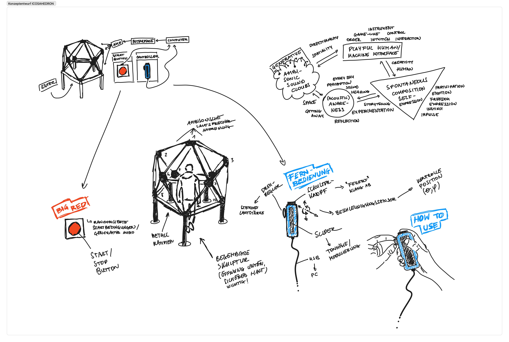

# Ambisonic-Icosahedron

Ambisonic Icosahedron is an interactive spatial audio sculpture project, designed for creating immersive 3D audio worlds that the participant can actively participate in. Using second-order Ambisonics and a controller interface, the sculpture is based on the geometry of an icosahedron (20 faces, 12 vertices). One one loudspeaker is mounted at each vertex, giving 12 channels, equally distributed across an imaginary spherical surface.  The purpose is to create a spatial sound field suitable for artistic installations and research environments.

##Key Features
- Real-time ambisonic playback via 12 speakers arranged in an icosahedral layout
- Integration of IEM’s AllRADecoder for flexible spatial decoding
- Optional binaural output for monitoring without the sculpture
- Visual configuration of loudspeaker angles within the plugin

##Intended Audience
- Sound artists
- Acoustic researchers
- Installation designers
- Interactive media creators

This repository also contains materials for the Ambisonic Controller Project, where we'll design a controller with four buttons, a touch interface, an Inertial Measurement Unit connected to an arduino. The arduino sends that data over USB to a PC that runs a maxpatch which parses the data. This is integrated into the ambisonic sculpture effects in order to control ambisonic effects and allow for the project's goal to create a spatial audio sculpture that allows participants to spontaneously create and compose abstract sonic scenes in virtual audio space.

We're using the following Parts:

| Function           | Component                        | Quantity | Info                                      |
|--------------------|----------------------------------|----------|-------------------------------------------|
| Data Exchange      | Arduino Nano33 IoT               | 1        | Collect I2C data, send to Max/MSP via USB |
| Position Detection | Adafruit BNO055                  | 1        | I2C 9DOF IMU                              |
| Slider             | Bela Trill Bar                   | 1        | I2C Touch slider bar                      |
| Buttons            | MKBKLLJY Momentary Push Button   | 4        | 7mm Momentary Push button Switch          |
| Case               | 3D-printed                       | 1        | 3D-printed case & assembly materials      |
| Screws             | M2x8mm Flathead                  | 4        | Top Part Assembly                         |
| Screws             | M1.2x5                           | 4        | Arduino Screws                            |
| Screws             | M1.7x6                           | 4        | BNO055 Screws                             |

How to wire:

D 2, 3, 4, 5 → Button 1 (x), 2 (<), 3 (>), 4 (Shoulder) (all other ends to gnd!)

D 1/GND → All buttons share common ground

GND → left side for Sensors / I2C controllers

D18 (SDA), D19(SCL) → Serial Data and serial clock for IMU and touchcontroller. Pay attention to the bus.

Bela trill needs 5V → Solder USB vbridge for the Nano33. We’ll check if the wiring is correct and if it outputs any data. See [Debugging Read Data](Arduino/read_data)

When this works, it confirms all sensors output data. We can then move on to integrate the Buttons and IMU and format the message so that it can be parsed easily in the maxpatch. See [Iko Controller Sketch](Arduino/iko_controller_arduino_sketch)

We’ll go on to max and create a serial object and read the serial from the controller at index 2 (it's probably gonna be different for you) with baud rate 115200. this should get max data:

[Iko Controller Maxpatch](Max/ico_v0.2.maxpat)