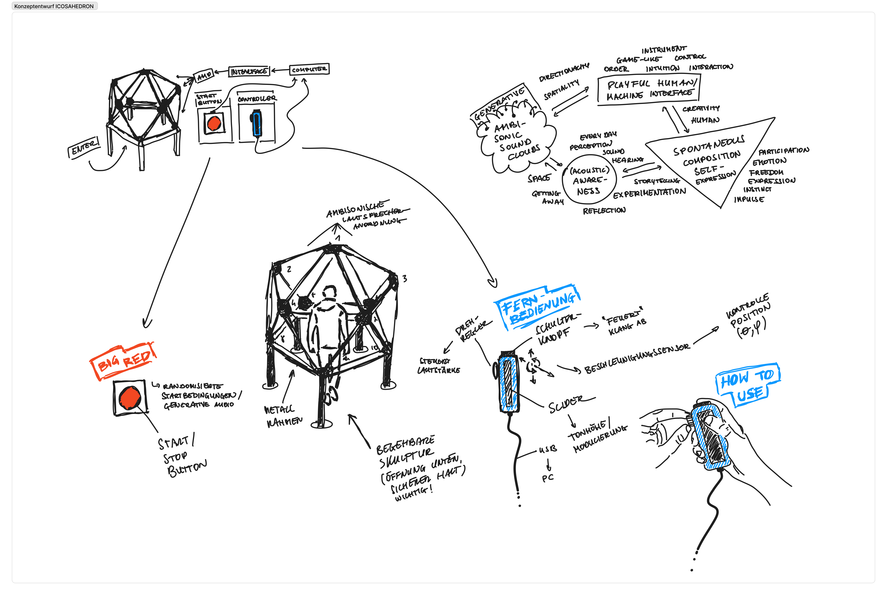

# Ambisonic-Icosahedron

##Project Overview
Ambisonic Icosahedron is a speaker sculpture project designed for immersive 3D audio playback using high-order Ambisonics. The sculpture is based on the geometry of an icosahedron (20 faces, 12 vertices), with one loudspeaker mounted at each vertex. Its purpose is to create a spatial sound field suitable for artistic installations and research environments.

Audio routing and processing are handled in Reaper so far, using the IEM Ambisonics Plugins, especially the AllRADecoder, which translates the ambisonic signal into the appropriate speaker configuration. A binaural decoder is also included for headphone-based monitoring.

##Key Features
- Real-time ambisonic playback via 12 speakers arranged in an icosahedral layout
- Integration of IEM’s AllRADecoder for flexible spatial decoding
- Optional binaural output for monitoring without the sculpture
- Visual configuration of loudspeaker angles within the plugin

##Intended Audience
- Sound artists
- Acoustic researchers
- Installation designers
- Interactive media creators