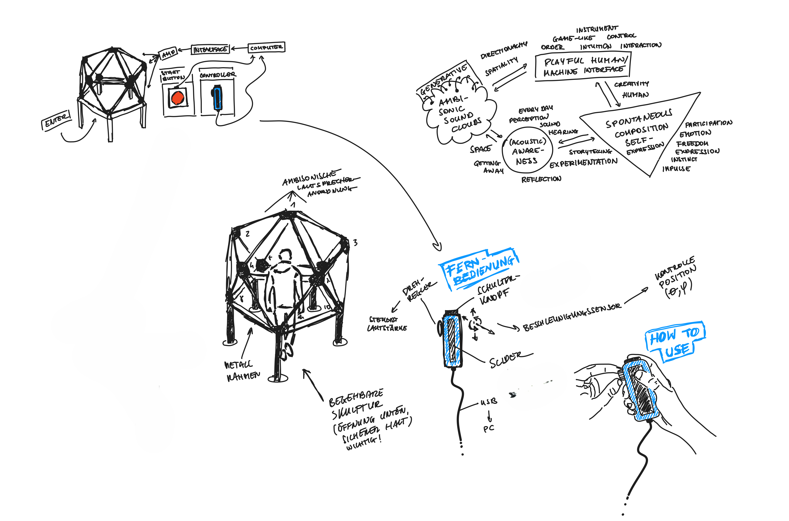
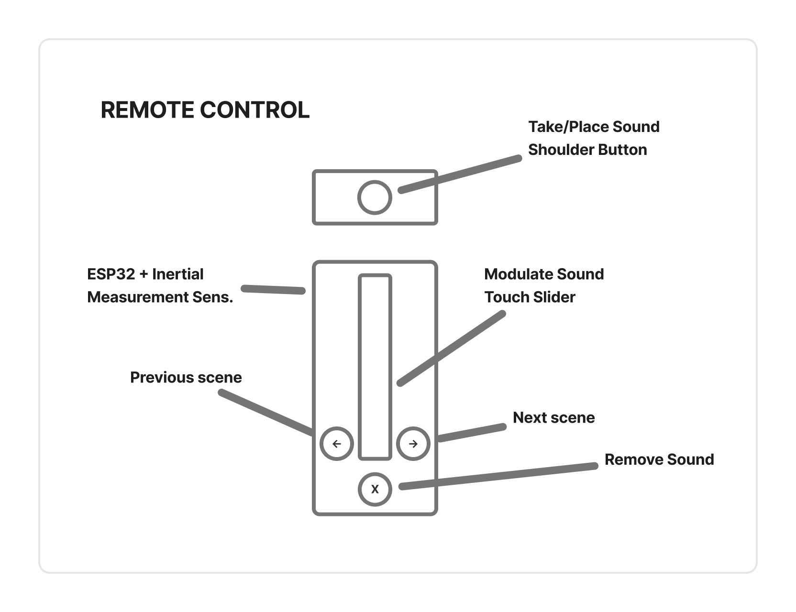

# Ambisonic-Icosahedron

This project is released for research, education, and non-commercial creative use.

Code is licensed under the PolyForm Noncommercial License 1.0.0.
Artwork, audio, documentation, and other media assets are licensed under CC BY-NC 4.0.

Commercial use is not permitted without prior written permission from the author.
For commercial licensing, please contact: [your email]

Ambisonic Icosahedron is an interactive spatial audio sculpture project, designed for creating immersive 3D audio worlds that a participant can actively take part in. Using [Ambisonics](https://de.wikipedia.org/wiki/Ambisonics) and a movement-sensing controller interface, the sculpture maps to the geometry of an icosahedron, with virtual audio sources originating from its twelve vertices, creating an audio scene consisting of equally distributed virtual audio sources across an imaginary spherical surface.

This project's purpose is to aid artistic installations and interactive audio experimentation in research environments.

## Key Features

- Real-time generation of an ambisonic signal using signals from a custom motion-controller
- Included sample sounds
- Ambisonic playback arranged in an icosahedral layout
- Integrates [IEM’s AllRADecoder](https://plugins.iem.at/) for spatial decoding

This repository also contains materials for the controller project, where we'll design a controller with four buttons, a touch interface, an Inertial Measurement Unit connected to an arduino. The arduino sends that data over USB to a PC that runs a maxpatch which parses the data. This is integrated into the ambisonic sculpture effects in order to control ambisonic effects and allow for the project's goal to create a spatial audio sculpture that allows participants to spontaneously create and compose abstract sonic scenes in virtual audio space.

We're using the following Parts:

| Function           | Component                      | Quantity | Info                                      |
| ------------------ | ------------------------------ | -------- | ----------------------------------------- |
| Data Exchange      | Arduino Nano33 IoT             | 1        | Collect I2C data, send to Max/MSP via USB |
| Position Detection | Adafruit BNO055                | 1        | I2C 9DOF IMU                              |
| Slider             | Bela Trill Bar                 | 1        | I2C Touch slider bar                      |
| Buttons            | MKBKLLJY Momentary Push Button | 4        | 7mm Momentary Push button Switch          |
| Case               | 3D-printed                     | 1        | 3D-printed case & assembly materials      |
| Screws             | M2x8mm Flathead                | 4        | Top Part Assembly                         |
| Screws             | M1.2x5                         | 4        | Arduino Screws                            |
| Screws             | M1.7x6                         | 4        | BNO055 Screws                             |

How to wire:

D 2, 3, 4, 5 → Button 1 (x), 2 (<), 3 (>), 4 (Shoulder). Buttons share common ground.

GND → left side for I2C

D18 (SDA), D19(SCL) → Serial data and clock for IMU and touchcontroller. Pay attention to the bus.

Bela trill needs 5V → Solder USB vbridge for the Arduino Nano33. For testing, see [read data](Arduino/read_data).

Check the controller's serial data stream [Iko Controller Sketch](Arduino/iko_controller_arduino_sketch).

For parising controller data, use [Max](https://cycling74.com/products/max) and open the project a serial object and read the serial from the controller at index 2 (it's probably gonna be different for you) with baud rate 115200. this should get max data:

[Iko Controller Maxpatch](max/ico.maxpat)

to document:

- new controller image. layout changed. (red button shoulder now is a panic button, stops sound, "X" now fires sounds)
- briefly explain maxpatch areas and what they do: how was a specific sound constellation reached? why does it work?
